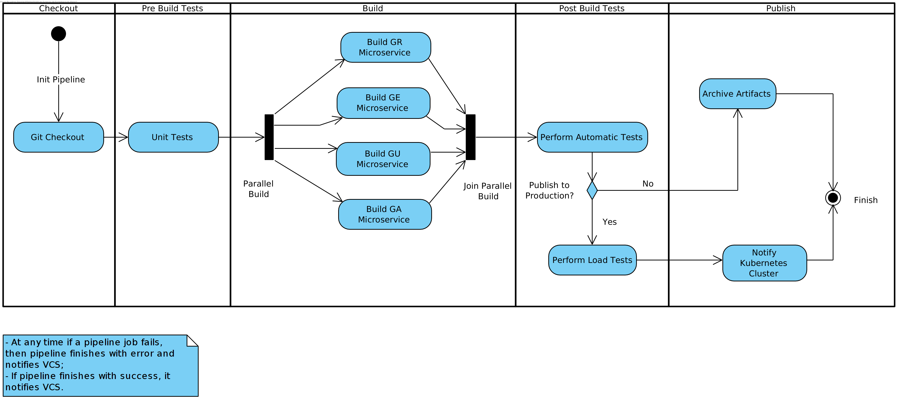

# Continuous Integration and Delivery

This folder exposes all documents related to the CI & CD processes applied for Acervo Biblioteca.

## Motivations

Today's software production and maintainability is getting more and more complex. Acervo Biblioteca is not an exception. By adopting the microservices pattern in decomposing the domain in smaller sub-domains, more software needs to be produced and more software needs to be maintained. *Small* software also usually means more portability and replication. Manual processes on a microservices philosophy is a tedious and slow job. If availability and consistency are concerns that need to be addressed, then automatic processes that build and ship software without human interaction, need to be applied.

## Goals

- Setup a Continuous Integration platform that performs automatic tasks such as building and verifying software;
- Setup a Continuous Delivery platform that continuous deploys and delivers software when asked;
- Increase Software Availability;
- Reduce manual software building processes.

## Requirements

Before designing the CI/CD processes, it is first needed to address the requirements, concerns and constraints that these need to take care of. The following bullet point list depicts the keypoints to be addressed:

- Software must be available on the cloud;
- New microservices software of specific endpoints should be launched if more than 50 requests per 5 seconds are performed on the API Gateways;
- No money budget means everything should be open-source and free of use;
- Automatic tests that validate software need to be executed before delivering these;
- Load / Throttling tests need to be executed before delivering a piece of software.

## Pipeline Design

The following UML activity diagram illustrates the pipeline that will handle the needed CI & CD processes:

The CI platform should be continuously checking if new changes on the repository are available and if so initialize the pipeline. It should also hold a flag that indicates whether the current build is to be published in production.

## Technologies

The following table describes the technologies being used and their responsibilities in the CI & CD processes:

|Technology|Responsibilities|
|----------|----------------|
|Bitbucket|Host the software code|
|Jenkins|Continuous Integration & Delivery platform that will listen repository changes, trigger and build the software.|
|Heroku|Run the software on the cloud|
|Docker|Container of the software|
|Docker Swarm|Launch new Docker containers in Heroku|